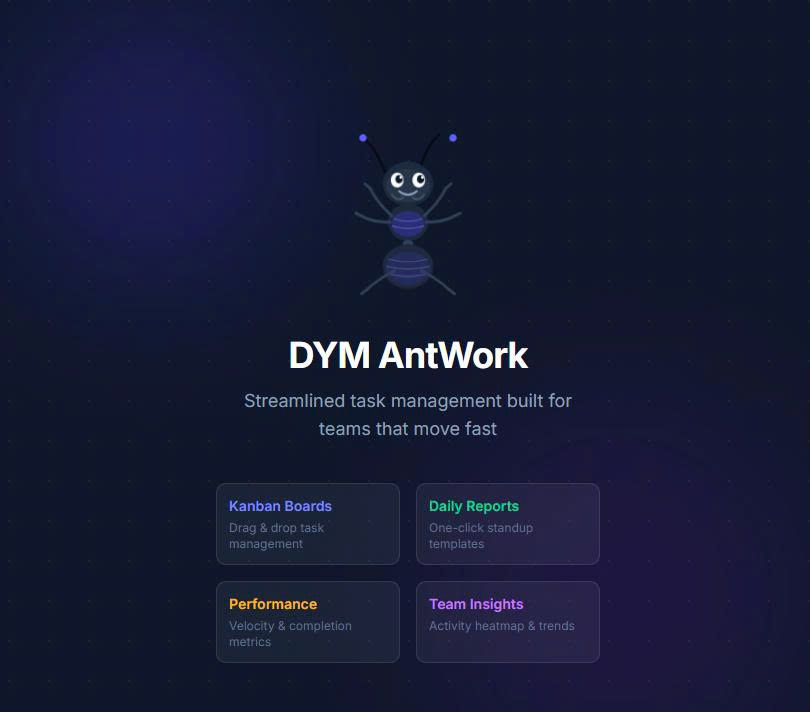

<div align="center">
<div>
  <h1 style="
    color: #0B0E23; 
    -webkit-text-stroke: 0.5px white; 
    font-weight: 800;
  ">
    AntWork 
    <small style="font-size:0.5em; -webkit-text-stroke: 0.5px white;">v.1.0.1</small>
  </h1>
</div>
  <p>Internal project management tool for <strong>team/company/enterprise</strong> scope. Multi-team task tracking with Kanban boards, calendar timelines, daily reports, performance metrics, and an AI-powered board assistant.</p>
  <small>_Created by Hoang Dung</small>
  <br>
  <br>
  
</div>

## Features (current stage - v1.0.1)

### Task Management
- **Hierarchical structure**: Project -> Epic -> Story -> Task -> Sub-task
- **Kanban board**: Drag-and-drop with 5 status columns (Backlog, To Do, In Progress, In Review, Done)
- **Calendar timeline**: Gantt-style view with `startDate` support for accurate bar positioning
- **Multi-assignee**: Tasks support multiple assignees; sub-tasks support single assignee
- **Story points**: Estimation at every level with automatic rollup from children

### AI Board Assistant (AntAgent)
- Chat-based interface on the Kanban board (right sidebar)
- Natural language commands in **English and Vietnamese**
- Example: *"Move 'Setup Middleware' to In Review"* or *"Chuyen task A sang Done"*
- Powered by some AI models with fallback mechanism.
- Other features will come soon

### Dashboard & Reports
- Time-based Japanese greeting (Ohayou/Konnichiwa/Konbanwa/Oyasuminasai)
- Activity heatmap (90-day contribution graph)
- Daily report generator with team summary view
- Performance metrics: velocity, completion rate, on-time rate, individual scores

### Admin Tools
- Team and user management
- **Workload Network**: Interactive force-directed graph (D3.js) visualizing user-project relationships with zoom, pan, drag, and click-to-highlight
- Role-based access control (Admin, Team Lead, Member)

### UX
- Command palette (`Ctrl+K`) with arrow key navigation
- Responsive sidebar navigation
- Ant mascot branding with animations

## Tech Stack

| Layer | Technology |
|-------|-----------|
| Framework | Next.js 15 (App Router, monolithic) |
| Database | MongoDB with Mongoose ODM |
| Auth | JWT + bcryptjs, httpOnly cookies |
| Data Fetching | TanStack React Query v5 |
| Styling | Tailwind CSS + shadcn/ui |
| Language | TypeScript (strict mode) |
| AI | Groq API + OpenRouter API (OpenAI-compatible) |
| Visualization | D3.js (force graph), Recharts (performance) |
| Validation | Zod |

## Getting Started

### Prerequisites
- Node.js 18+
- MongoDB instance (local or Atlas)

### Installation

```bash
git clone https://github.com/dungnotnull/ant-work.git
cd ant-work
npm install
```

### Environment Variables

Copy `.env.example` to `.env.local` and fill in:

```env
MONGODB_URI=mongodb://localhost:27017/ant-work
JWT_SECRET=your-secret-key
NEXT_PUBLIC_APP_URL=http://localhost:3000
GROQ_API_KEY=your-groq-key
OPENROUTER_API_KEY=your-openrouter-key
```

### Run

```bash
npm run dev
```

Open [http://localhost:3000](http://localhost:3000).

### Seed Demo Data

```bash
curl -X POST http://localhost:3000/api/seed
```

Demo accounts:

| Email | Password | Role |
|-------|----------|------|
| admin@dymvietnam.net | password | Admin |
| lead@dymvietnam.net | password | Team Lead |
| john@dymvietnam.net | password | Member |
| jane@dymvietnam.net | password | Member |

## Project Structure

```
src/
  app/
    (auth)/            -- Login, Register (no sidebar)
    (dashboard)/       -- Main app pages (sidebar layout)
      admin/           -- Admin: teams, users, network
      daily-report/    -- Report templates and summaries
      dashboard/       -- Overview with stats and heatmap
      my-tasks/        -- Personal task view
      performance/     -- Velocity and metrics
      projects/        -- Project detail, board, epics
      tasks/           -- Task detail with timer and comments
    api/               -- REST API routes
      ant-agent/       -- AI chat endpoint
      auth/            -- Login, register, logout
      projects/        -- Project CRUD, board, timeline
      tasks/           -- Task CRUD, comments, timer
      ...
  lib/
    auth.ts            -- JWT session handling
    constants.ts       -- Status, priority, role enums
    mongodb.ts         -- Mongoose connection singleton
    validations/       -- Zod schemas for all endpoints
    utils/greeting.ts  -- Japanese time-based greeting
  models/              -- Mongoose models
  components/
    admin/             -- WorkloadNetwork (D3)
    board/             -- KanbanBoard, KanbanCard, AntAgentChat
    dashboard/         -- ActivityHeatmap, EfficiencyLeaderboard
    layout/            -- Sidebar, CommandPalette, Breadcrumbs
    performance/       -- VelocityChart, score cards
    project/           -- ProjectTimeline (calendar)
    tasks/             -- TaskStatusBadge, CommentList, TaskTimer
    ui/                -- shadcn/ui components
  hooks/
    useAuth.ts         -- Auth state hook
```

## API Overview

All endpoints return `{ success: boolean, data?: any, error?: string }`.

| Method | Endpoint | Description |
|--------|----------|-------------|
| POST | `/api/auth/login` | Login, set httpOnly cookie |
| POST | `/api/auth/register` | Register (@dymvietnam.net only) |
| GET | `/api/projects/:id/board` | Kanban board data grouped by status |
| GET | `/api/projects/:id/timeline` | Tasks with date ranges for calendar |
| PUT | `/api/tasks/:id` | Update task (status, assignees, etc.) |
| POST | `/api/ant-agent/chat` | AI chat with tool calling |
| GET | `/api/admin/workload-network` | Network graph data |
| POST | `/api/seed` | Seed demo data |

## Architecture Decisions

- **Monolithic Next.js** -- all backend logic in API routes, no separate server
- **Mongoose singleton** -- connection pattern for serverless compatibility
- **JWT in httpOnly cookies** -- not localStorage, for XSS protection
- **React Query everywhere** -- no raw `useEffect` + `fetch` in page components
- **AntAgent safety** -- single tool definition (`change_task_status`), system prompt forbids all other actions, rate-limited to 20 req/min

## License

Proprietary -- DYM Vietnam internal use only.
